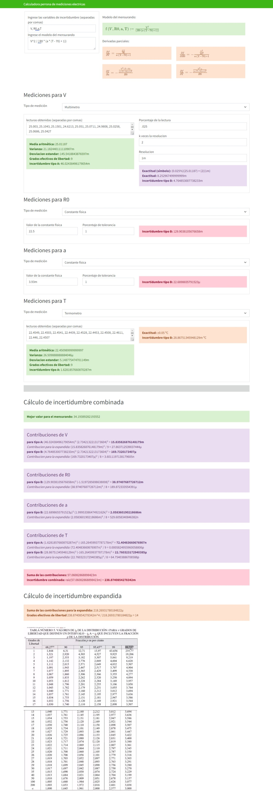

# mediciones eléctricas

Programa para cálculos de incertidumbres de mediciones eléctricas y apoyo para los exámenes

Desarrollado en equipo por

- Pintor Olivares Luis M
- Basurto Sosa José Luis
- Parra fuentes Axel Valentín

para la materia de mediciones eléctricas.

